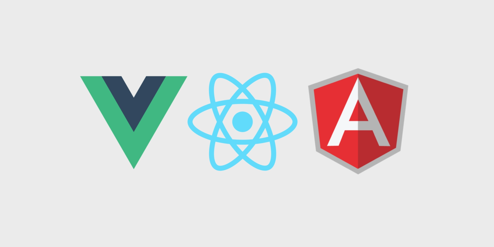

# Vue.js и варианты его использования
## О Vue.js и авторе

Создателем Vue.js является Evan You, бывший сотрудник Google и Meteor Dev Group. Начал он разрабатывать фреймворк
в 2013-м, а в феврале 2014-го состоялся первый публичный релиз. Vue широко используется среди китайских компаний,
например: Alibaba, Baidu, Xiaomi, Sina Weibo и др. Он входит в ядро Laravel и PageKit. В 2017 году свободная система
управления репозиториями GitLab тоже перешла на Vue.js.

<p align="center">

</p>

Первоначально целью было создать супер простой инструмент, чтобы синхронизировать DOM с объектами JS.
Это была изначальная идея. Как проект стал набирать популярность, его стали расширять и добавлять больше элементов в
экосистему, что в конечном счёте привело к фреймворку.

## Варианты использования

### Вариант №1 Подключение через CDN

Первый способ использования Vue, который мы исследуем, заключается в подключении к странице скрипта Vue с помощью тега
`<script>`. Если вы уже работали с JavaScript, то тут для вас не будет ничего нового. А именно, речь идёт о том, что
имеется
HTML-страница, которую надо оснастить неким функционалом, реализованным в какой-то JS-библиотеке. Для этого библиотеку
подключают к странице с помощью тега `<script>`. При этом надо отметить, что рассматриваемый здесь метод использования
Vue подходит не только для разработки учебного приложения. Он находит применение и в реальных проектах.

Обычно довольно сложно вводить новые инструменты, библиотеки или фреймворки в реальные проекты, скажем, в организации, 
где работает программист. Например, вам очень нравится работать с Vue. Вы идёте к начальству и спрашиваете — можно ли вам
переписать весь проект на Vue. В ответ на такой вопрос вам, почти без вариантов, тут же ответят отказом. Если же вы
предложите использовать Vue на некоей странице, разработкой которой вы в данный момент занимаетесь, то такое предложение
уже вполне может быть принято.

```
<!-- Версия для разработки, отображает полезные предупреждения в консоли -->
<script src="https://cdn.jsdelivr.net/npm/vue@2/dist/vue.js"></script>
```

```
<!-- Production-версия, оптимизированная для размера и скорости -->
<script src="https://cdn.jsdelivr.net/npm/vue@2"></script>
```

#### «Hello, Vue!»

В этом приложении мы собираемся вывести на экран текст «Hello, Vue!», а ниже текста — текущие время и дату.
Затем мы напишем код, который поддерживает дату и время в актуальном состоянии. В результате пользователь приложения
сможет пользоваться им как обычными часами, наблюдая течение времени. Создадим новую папку, в ней создадим файл 
index.html, а в этот файл добавим следующий код:

```
<!DOCTYPE html>
<html lang="en">
<head>
  <meta charset="UTF-8">
  <meta name="viewport" content="width=device-width, initial-scale=1.0">
  <meta http-equiv="X-UA-Compatible" content="ie=edge">
  <title>Hello, Vue.js</title>
</head>
<body>

</body>
</html>
```
Теперь у нас есть каркас страницы, основа будущего приложения. Поэтому нашим следующим шагом будет подключение к этой
странице скрипта Vue.js. Добавим в код страницы, прямо над закрывающим тегом `</body>`, следующее:

```
<!-- Версия для разработки включает в себя возможность вывода в консоль полезных уведомлений -->
<script src="https://cdn.jsdelivr.net/npm/vue@2/dist/vue.js"></script>
<script>

</script>
```

Теперь, после подключения скрипта, нам, в первую очередь, нужно добавить на страницу корневой элемент, к которому будет
подключён экземпляр Vue:

```
<div id="app">

</div>
```

После этого создадим новый экземпляр Vue и сообщим ему о том, к какому корневому элементу ему нужно подключиться:

```
<script>
  const app = new Vue({
    el: '#app'
  })
</script>
```

Теперь создадим пару переменных. Они будут хранить значения, которые мы используем для вывода информации на страницу.
Делается это путём объявления свойств объекта `data:`

```
<script>
  const app = new Vue({
    el: '#app',
    data: {
      message: 'Hello, Vue!',
      now: new Date()
    
  })
</script>
```
Сейчас, когда данные готовы, мы готовы прибегнуть к возможностям Vue по выводу их на страницу. Делается это с 
использованием простых, удобных для восприятия конструкций:

```
<div id="app">
  <h1>{{ message }}</h1>
  <p>{{ now }}</p>
</div>
```
<iframe height="265" style="width: 100%;" scrolling="no" title="Vue.JS CDN" src="https://codepen.io/skripchenkoCP/embed/vYgegOE?height=265&theme-id=dark&default-tab=html,result" frameborder="no" loading="lazy" allowtransparency="true" allowfullscreen="true">
See the Pen <a href='https://codepen.io/skripchenkoCP/pen/vYgegOE'>Vue.JS CDN</a> by Skripchenko Anton
(<a href='https://codepen.io/skripchenkoCP'>@skripchenkoCP</a>) on <a href='https://codepen.io'>CodePen</a>.
</iframe>

##### Добавим немного реактивности

Создаём инпут, в котором используем директиву `v-model` (Двусторонним образом связывает элемент ввода данных или компонент с переменной).
Также поправим наш `h1`, добавив простую конкатинацию двух переменных.

- Директива подробно описана в руководстве по [ссылке](https://ru.vuejs.org/v2/api/#v-model)
```
  <input v-model = name></input> 
  <h1>{{ message + name }}</h1>
```
Немного изменим свойства в объекте `data`:
```
  data: {  
    message: 'Hello, ',
    name: 'John',
    now: new Date()
  }  
```

<iframe height="265" style="width: 100%;" scrolling="no" title="Vue.JS CDN #2" src="https://codepen.io/skripchenkoCP/embed/xxgXrpv?height=265&theme-id=dark&default-tab=js,result" frameborder="no" loading="lazy" allowtransparency="true" allowfullscreen="true">
  See the Pen <a href='https://codepen.io/skripchenkoCP/pen/xxgXrpv'>Vue.JS CDN #2</a> by Skripchenko Anton
  (<a href='https://codepen.io/skripchenkoCP'>@skripchenkoCP</a>) on <a href='https://codepen.io'>CodePen</a>.
</iframe>


### Вариант №2 VUE CLI

Vue CLI — полноценная система для быстрой разработки на Vue.js, предоставляющая:

- Интерактивное создание проекта через @vue/cli.
- Быстрое прототипирование через @vue/cli + @vue/cli-service-global без конфигурации.
- Runtime-зависимость (@vue/cli-service) предоставляющая:
- Возможность обновления;
- Создана поверх webpack, с оптимальными настройками по умолчанию;
- Настройка с помощью конфигурационного файла в проекте;
- Расширяемость плагинами
- Большая коллекция официальных плагинов, интегрирующих лучшие инструменты экосистемы фронтенда.
- Полноценный графический пользовательский интерфейс для создания и управления проектами Vue.js.

#### Установка Vue CLI

Для начала нам нужно установить Vue CLI глобально. Прежде чем это сделать — нужно обзавестись Node.js, NPM или Yarn.

```
npm install -g @vue/cli
```
Для создания нового приложения можно воспользоваться командой `vue create`

Команда create принимает имя приложения. Создадим новое Vue-приложение, выполнив следующую команду:

```
vue create hello-vue
```
В ходе выполнения этой команды в текущей директории будет создана новая папка hello-vue. Подробное описание процесса
создания приложения с помощью vue create можно подсмотреть в официальной [документации](https://cli.vuejs.org/ru/).

Сейчас же нам достаточно согласиться с предлагаемыми по умолчанию параметрами. Это приведёт к созданию нового приложения.

После установки для запуска нашего приложения в режиме разработчика достаточно выполнить следующую команду:

```
npm run serve
```
Она запустит сервер, после чего выдаст сведения о том, как открыть начальную страницу приложения. А именно, это http://localhost:8080/.

### Vue UI

Вместе с Vue CLI, с инструментом командной строки, устанавливается и инструмент Vue UI. Для того чтобы его запустить — воспользуйтесь следующей командой:

```
vue ui
```
В ходе её выполнения будет открыта страница нового приложения, находящаяся по адресу http://localhost:8000/dashboard.

С помощью Vue UI можно создать новый проект, который будет обладать теми же возможностями, что и проект, созданный средствами командной строки.

!> **Личный опыт:** Я использую Vue UI для удобного контроля зависимостей. В интерфейсе можно увидеть есть ли доступные обновления
той или иной зависимости и нажатием одной кнопки её обновить. Также очень удобно просматривать размер текущего бандла, для
понимания того, что можно оптимизировать.

## Vue vs React vs Angular

<p align="center">

</p>

### Vue

Особенности Vue:

- Привязка данных;
- Производительный (есть Virtual DOM);
- Простота изучения;
- Адаптивность и подробная документация;
- Масштабирование;
- Оптимизация HTML-блоков;
- Миниатюрный размер;
- Шаблоны.
Vue – это молодой фреймворк с растущей аудиторией. Самый простой для изучения в тройке, можно начать работу «из коробки»,
при этом достаточно мощный для профессиональных разработчиков. Vue не имеет такого количества встроенных функций, как Angular,
но их больше, чем у React. Популярный выбор среди новичков, есть подробная документация на русском языке.

Фреймворк используют Adobe, Behance, Reuters, Xiaomi, Gitlab, WizzAir, EuroNews, Grammarly, Codeship и Alibaba.

Недостатки:

 - Мало туториалов. Хорошая документация – это плюс, но для специфичных случаев было бы полезно иметь больше различных примеров.

### React

Особенности:

- Компонентно-ориентированный;
- Декларативный;
- Производительный (благодаря React Virtual DOM);
- Рендеринг со стороны сервера из коробки;
- Наличие Redux;
- Поддержка PWA;
- JSX.

React предлагает простое и функциональное создание компонентов, а также пропагандирует их использование для поддержания элегантного кода API. Фреймворк очень популярен, особенно в различных стартапах. Имея большой выбор легкодоступных опенсорсных плагинов и расширений, можно разработать практически любой тип веб-сайта. Шаблоны компонентов создаются с использованием JSX, это может немного отличаться от того, к чему вы привыкли.

Наличие большого выбора расширений – это здорово, но для начинающих разработчиков может оказаться довольно запутанным.

Примеры компаний, использующих React: Facebook, Instagram, Atlasian, Codepen, Pinterest, Asana, Сбербанк, Revolut, Авито, Discord.

Недостатки:

- Использование шаблонов вперемежку с JSX для начинающего может показаться странным.
- Может и не совсем недостаток, но непрямолинейность выбора этапов развития проекта обычно разруливается только опытными руководителями.

### Angular

Angular

Особенности:

- Универсальный;
- Нативный;
- Сложный;
- Используется с Typescript;
- Интеллектуальное автозаполнение HTML-компонента;
- Архитектура рассчитана на крупные проекты;
- MVVM-модель.
- Angular обеспечивает больше всяких штук из коробки, в том числе более удачный CLI, чем React или Vue, вследствие чего построение серьезных решений является более простым. Angular популярен в энтерпрайз-среде, где имеет широкую публику. Код несколько пересыщен и сложен по сравнению с другими фреймворками, но это дело привычки.

Фреймворк используют: Skyeng, Iponweb, IsSoft, Positive Technology, MTS, Grid Dynamics, Sitecore, Netcraker, Google.

Недостатки:

- Слабая производительность, но это решается с помощью ChangeDetectionStrategy.
- Наличие массы разнообразных структур (Modules, Components, Injectables, Pipes) делает нелегкой участь молодого специалиста.

### Сравнение Vue, React и Angular

#### Простота использования

React и Vue во многом похожи, они оба используют Virutal DOM, предоставляют компонентную структуру, сторонние вопросы выносятся в дополнительные библиотеки. Из-за того, что React и Vue, по большей части, сосредоточены на создании интерфейса пользователя, а Angular – на приложениях, последний более сложен для начинающих. Работа с React и Vue становится труднее в крупных приложениях.

React превосходит Vue в разнообразии экосистемы и изобилии доступных пользовательских средств отрисовки. В React абсолютно всё – это JavaScript, в то время как Vue в большей мере основывается на классических веб-технологиях, к примеру, любой валидный HTML также будет валидным шаблоном Vue.

В сравнении с Angular оба других фреймворка – и React, и Vue – проявляют бо́льшую гибкость. Но в этом есть и преимуществ Angular: не приходится придумывать свою реализуцию, только следовать правилам.

Развернутое сравнение всех трех фреймворков также дается на странице Vue.

#### Инструменты

Все три фреймворка предоставляют CLI, что облегчает создание новых проектов и поддержку непрерывного развития. Кроме того, все они хорошо уживаются с популярными IDE, такими как VS Code и Atom.

#### Производительность

Безусловно, производительность может варьироваться в зависимости от ситуации, но по большей части все три фреймворка довольно быстры – не зря они имеют такую популярность. Производительность обычно не является главным критерием при выборе между перечисленными фреймворками. Но если вас интересуют цифры, изучите [сравнение производительности](https://stefankrause.net/js-frameworks-benchmark8/table.html) по отрисовке и обновлению дерева простых компонентов.
